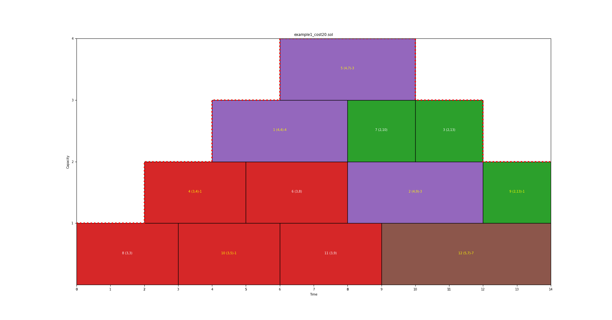

# One Machine Scheduling with Time Dependent Capacity

See https://github.com/raulmencia/One-Machine-Scheduling-with-Time-Dependent-Capacity-via-Efficient-Memetic-Algorithms

## Results

The name of each problem instance conforms to i&lt;n&gt;\_&lt;MC&gt;\_&lt;k&gt; 

* n is the number of jobs
* MC is the Maximum Capacity
* k is an identification number for the problem instance of the specific set

| Problem                                              |   Memetic Hybrid best | Our's best (HELS=Hybrid Exact-Local Search)         |   Best known |
|:-----------------------------------------------------|----------------------:|----------------------------------------------------:|-------------:|
| [i120_3_1](./problem_instances/i120_3_1.txt)         |                   848 | **[848](./solutions/i120_3_1_cost848.sol)**         |          848 |
| [i120_3_2](./problem_instances/i120_3_2.txt)         |                  3568 | [3570](./solutions/i120_3_2_cost3570.sol)           |         3568 |
| [i120_3_3](./problem_instances/i120_3_3.txt)         |                  2410 | **[2410](./solutions/i120_3_3_cost2410.sol)**       |         2410 |
| [i120_3_4](./problem_instances/i120_3_4.txt)         |                  1019 | **[1019](./solutions/i120_3_4_cost1019.sol)**       |         1019 |
| [i120_3_5](./problem_instances/i120_3_5.txt)         |                  3858 | **[3858](./solutions/i120_3_5_cost3858.sol)**       |         3858 |
| [i120_3_6](./problem_instances/i120_3_6.txt)         |                  3120 | **[3120](./solutions/i120_3_6_cost3120.sol)**       |         3120 |
| [i120_3_7](./problem_instances/i120_3_7.txt)         |                   720 | **[720](./solutions/i120_3_7_cost720.sol)**         |          720 |
| [i120_3_8](./problem_instances/i120_3_8.txt)         |                  4084 | **[4084](./solutions/i120_3_8_cost4084.sol)**       |         4084 |
| [i120_3_9](./problem_instances/i120_3_9.txt)         |                  1663 | **[1663](./solutions/i120_3_9_cost1663.sol)**       |         1663 |
| [i120_3_10](./problem_instances/i120_3_10.txt)       |                  1268 | **[1268](./solutions/i120_3_10_cost1268.sol)**      |         1268 |
| [i120_5_1](./problem_instances/i120_5_1.txt)         |                  1030 | **[1030](./solutions/i120_5_1_cost1030.sol)**       |         1030 |
| [i120_5_2](./problem_instances/i120_5_2.txt)         |                  1511 | [1514](./solutions/i120_5_2_cost1514.sol)           |         1511 |
| [i120_5_3](./problem_instances/i120_5_3.txt)         |                   959 | **[959](./solutions/i120_5_3_cost959.sol)**         |          959 |
| [i120_5_4](./problem_instances/i120_5_4.txt)         |                   496 | **[496](./solutions/i120_5_4_cost496.sol)**         |          496 |
| [i120_5_5](./problem_instances/i120_5_5.txt)         |                  3061 | **[3061](./solutions/i120_5_5_cost3061.sol)**       |         3061 |
| [i120_5_6](./problem_instances/i120_5_6.txt)         |                   455 | **[455](./solutions/i120_5_6_cost455.sol)**         |          455 |
| [i120_5_7](./problem_instances/i120_5_7.txt)         |                   519 | **[519](./solutions/i120_5_7_cost519.sol)**         |          519 |
| [i120_5_8](./problem_instances/i120_5_8.txt)         |                  1214 | **[1214](./solutions/i120_5_8_cost1214.sol)**       |         1214 |
| [i120_5_9](./problem_instances/i120_5_9.txt)         |                  3223 | [3231](./solutions/i120_5_9_cost3231.sol)           |         3223 |
| [i120_5_10](./problem_instances/i120_5_10.txt)       |                  1131 | **[1131](./solutions/i120_5_10_cost1131.sol)**      |         1131 |
| [i120_7_1](./problem_instances/i120_7_1.txt)         |                  1120 | [1121](./solutions/i120_7_1_cost1121.sol)           |         1120 |
| [i120_7_2](./problem_instances/i120_7_2.txt)         |                  2725 | **[2725](./solutions/i120_7_2_cost2725.sol)**       |         2725 |
| [i120_7_3](./problem_instances/i120_7_3.txt)         |                  3493 | [3505](./solutions/i120_7_3_cost3505.sol)           |         3493 |
| [i120_7_4](./problem_instances/i120_7_4.txt)         |                  4021 | [4028](./solutions/i120_7_4_cost4028.sol)           |         4021 |
| [i120_7_5](./problem_instances/i120_7_5.txt)         |                  3059 | [3078](./solutions/i120_7_5_cost3078.sol)           |         3059 |
| [i120_7_6](./problem_instances/i120_7_6.txt)         |                  2640 | **[2640](./solutions/i120_7_6_cost2640.sol)**       |         2640 |
| [i120_7_7](./problem_instances/i120_7_7.txt)         |                  1655 | **[1655](./solutions/i120_7_7_cost1655.sol)**       |         1655 |
| [i120_7_8](./problem_instances/i120_7_8.txt)         |                  3225 | **[3225](./solutions/i120_7_8_cost3225.sol)**       |         3225 |
| [i120_7_9](./problem_instances/i120_7_9.txt)         |                  4470 | [4474](./solutions/i120_7_9_cost4474.sol)           |         4470 |
| [i120_7_10](./problem_instances/i120_7_10.txt)       |                   493 | **[493](./solutions/i120_7_10_cost493.sol)**        |          493 |
| [i120_10_1](./problem_instances/i120_10_1.txt)       |                   746 | [749](./solutions/i120_10_1_cost749.sol)            |          746 |
| [i120_10_2](./problem_instances/i120_10_2.txt)       |                  1124 | [1125](./solutions/i120_10_2_cost1125.sol)          |         1124 |
| [i120_10_3](./problem_instances/i120_10_3.txt)       |                  1442 | [1453](./solutions/i120_10_3_cost1453.sol)          |         1442 |
| [i120_10_4](./problem_instances/i120_10_4.txt)       |                   887 | **[887](./solutions/i120_10_4_cost887.sol)**        |          887 |
| [i120_10_5](./problem_instances/i120_10_5.txt)       |                  1447 | **[1447](./solutions/i120_10_5_cost1447.sol)**      |         1447 |
| [i120_10_6](./problem_instances/i120_10_6.txt)       |                  1118 | **[1118](./solutions/i120_10_6_cost1118.sol)**      |         1118 |
| [i120_10_7](./problem_instances/i120_10_7.txt)       |                  2463 | **[2463](./solutions/i120_10_7_cost2463.sol)**      |         2463 |
| [i120_10_8](./problem_instances/i120_10_8.txt)       |                   721 | **[721](./solutions/i120_10_8_cost721.sol)**        |          721 |
| [i120_10_9](./problem_instances/i120_10_9.txt)       |                   977 | [983](./solutions/i120_10_9_cost983.sol)            |          977 |
| [i120_10_10](./problem_instances/i120_10_10.txt)     |                   820 | **[820](./solutions/i120_10_10_cost820.sol)**       |          820 |
| [i250_10_1](./problem_instances/i250_10_1.txt)       |                  4094 | [4103](./solutions/i250_10_1_cost4103.sol)          |         4094 |
| [i250_10_2](./problem_instances/i250_10_2.txt)       |                   506 | **[506](./solutions/i250_10_2_cost506.sol)**        |          506 |
| [i250_10_3](./problem_instances/i250_10_3.txt)       |                  1349 | **[1349](./solutions/i250_10_3_cost1349.sol)**      |         1349 |
| [i250_10_4](./problem_instances/i250_10_4.txt)       |                  4731 | **[4731](./solutions/i250_10_4_cost4731.sol)**      |         4731 |
| [i250_10_5](./problem_instances/i250_10_5.txt)       |                  6390 | [6391](./solutions/i250_10_5_cost6391.sol)          |         6390 |
| [i250_10_6](./problem_instances/i250_10_6.txt)       |                  6280 | [6284](./solutions/i250_10_6_cost6284.sol)          |         6280 |
| [i250_10_7](./problem_instances/i250_10_7.txt)       |                  4497 | [4511](./solutions/i250_10_7_cost4511.sol)          |         4497 |
| [i250_10_8](./problem_instances/i250_10_8.txt)       |                  5881 | [5887](./solutions/i250_10_8_cost5887.sol)          |         5881 |
| [i250_10_9](./problem_instances/i250_10_9.txt)       |                  5321 | [5327](./solutions/i250_10_9_cost5327.sol)          |         5321 |
| [i250_10_10](./problem_instances/i250_10_10.txt)     |                  1293 | **[1293](./solutions/i250_10_10_cost1293.sol)**     |         1293 |
| [i250_20_1](./problem_instances/i250_20_1.txt)       |                  5573 | **[5573](./solutions/i250_20_1_cost5573.sol)**      |         5573 |
| [i250_20_2](./problem_instances/i250_20_2.txt)       |                  1882 | [1888](./solutions/i250_20_2_cost1888.sol)          |         1882 |
| [i250_20_3](./problem_instances/i250_20_3.txt)       |                  2813 | **[2813](./solutions/i250_20_3_cost2813.sol)**      |         2813 |
| [i250_20_4](./problem_instances/i250_20_4.txt)       |                  2525 | **[2525](./solutions/i250_20_4_cost2525.sol)**      |         2525 |
| [i250_20_5](./problem_instances/i250_20_5.txt)       |                  1054 | **[1054](./solutions/i250_20_5_cost1054.sol)**      |         1054 |
| [i250_20_6](./problem_instances/i250_20_6.txt)       |                  1583 | [1605](./solutions/i250_20_6_cost1605.sol)          |         1583 |
| [i250_20_7](./problem_instances/i250_20_7.txt)       |                  1565 | [1570](./solutions/i250_20_7_cost1570.sol)          |         1565 |
| [i250_20_8](./problem_instances/i250_20_8.txt)       |                  2190 | **[2190](./solutions/i250_20_8_cost2190.sol)**      |         2190 |
| [i250_20_9](./problem_instances/i250_20_9.txt)       |                  1553 | **[1553](./solutions/i250_20_9_cost1553.sol)**      |         1553 |
| [i250_20_10](./problem_instances/i250_20_10.txt)     |                  6531 | [6541](./solutions/i250_20_10_cost6541.sol)         |         6531 |
| [i250_30_1](./problem_instances/i250_30_1.txt)       |                  3013 | **[3013](./solutions/i250_30_1_cost3013.sol)**      |         3013 |
| [i250_30_2](./problem_instances/i250_30_2.txt)       |                  3054 | **[3054](./solutions/i250_30_2_cost3054.sol)**      |         3054 |
| [i250_30_3](./problem_instances/i250_30_3.txt)       |                  4758 | **[4753](./solutions/i250_30_3_cost4753.sol)**      |         4753 |
| [i250_30_4](./problem_instances/i250_30_4.txt)       |                  4098 | **[4093](./solutions/i250_30_4_cost4093.sol)**      |         4093 |
| [i250_30_5](./problem_instances/i250_30_5.txt)       |                  4197 | **[4194](./solutions/i250_30_5_cost4194.sol)**      |         4194 |
| [i250_30_6](./problem_instances/i250_30_6.txt)       |                  5034 | **[5019](./solutions/i250_30_6_cost5019.sol)**      |         5019 |
| [i250_30_7](./problem_instances/i250_30_7.txt)       |                  3641 | **[3641](./solutions/i250_30_7_cost3641.sol)**      |         3641 |
| [i250_30_8](./problem_instances/i250_30_8.txt)       |                   686 | **[686](./solutions/i250_30_8_cost686.sol)**        |          686 |
| [i250_30_9](./problem_instances/i250_30_9.txt)       |                  1502 | **[1502](./solutions/i250_30_9_cost1502.sol)**      |         1502 |
| [i250_30_10](./problem_instances/i250_30_10.txt)     |                  5197 | [5193](./solutions/i250_30_10_cost5193.sol)         |         5188 |
| [i500_10_1](./problem_instances/i500_10_1.txt)       |                  4614 | **[4614](./solutions/i500_10_1_cost4614.sol)**      |         4614 |
| [i500_10_2](./problem_instances/i500_10_2.txt)       |                   822 | **[822](./solutions/i500_10_2_cost822.sol)**        |          822 |
| [i500_10_3](./problem_instances/i500_10_3.txt)       |                   951 | [953](./solutions/i500_10_3_cost953.sol)            |          951 |
| [i500_10_4](./problem_instances/i500_10_4.txt)       |                  2102 | [2116](./solutions/i500_10_4_cost2116.sol)          |         2102 |
| [i500_10_5](./problem_instances/i500_10_5.txt)       |                   610 | **[610](./solutions/i500_10_5_cost610.sol)**        |          610 |
| [i500_10_6](./problem_instances/i500_10_6.txt)       |                  5981 | **[5981](./solutions/i500_10_6_cost5981.sol)**      |         5981 |
| [i500_10_7](./problem_instances/i500_10_7.txt)       |                  2768 | [2783](./solutions/i500_10_7_cost2783.sol)          |         2768 |
| [i500_10_8](./problem_instances/i500_10_8.txt)       |                  4460 | **[4460](./solutions/i500_10_8_cost4460.sol)**      |         4460 |
| [i500_10_9](./problem_instances/i500_10_9.txt)       |                   462 | **[462](./solutions/i500_10_9_cost462.sol)**        |          462 |
| [i500_10_10](./problem_instances/i500_10_10.txt)     |                  1998 | [2008](./solutions/i500_10_10_cost2008.sol)         |         1998 |
| [i500_20_1](./problem_instances/i500_20_1.txt)       |                  7649 | **[7569](./solutions/i500_20_1_cost7569.sol)**      |         7569 |
| [i500_20_2](./problem_instances/i500_20_2.txt)       |                   790 | **[790](./solutions/i500_20_2_cost790.sol)**        |          790 |
| [i500_20_3](./problem_instances/i500_20_3.txt)       |                  8941 | [8970](./solutions/i500_20_3_cost8970.sol)          |         8941 |
| [i500_20_4](./problem_instances/i500_20_4.txt)       |                  1272 | **[1272](./solutions/i500_20_4_cost1272.sol)**      |         1272 |
| [i500_20_5](./problem_instances/i500_20_5.txt)       |                  1719 | [1744](./solutions/i500_20_5_cost1744.sol)          |         1717 |
| [i500_20_6](./problem_instances/i500_20_6.txt)       |                  9110 | **[9097](./solutions/i500_20_6_cost9097.sol)**      |         9097 |
| [i500_20_7](./problem_instances/i500_20_7.txt)       |                   523 | **[523](./solutions/i500_20_7_cost523.sol)**        |          523 |
| [i500_20_8](./problem_instances/i500_20_8.txt)       |                  3180 | [3192](./solutions/i500_20_8_cost3192.sol)          |         3180 |
| [i500_20_9](./problem_instances/i500_20_9.txt)       |                  6291 | [6338](./solutions/i500_20_9_cost6338.sol)          |         6289 |
| [i500_20_10](./problem_instances/i500_20_10.txt)     |                  5661 | [5659](./solutions/i500_20_10_cost5659.sol)         |         5618 |
| [i500_30_1](./problem_instances/i500_30_1.txt)       |                  2670 | **[2670](./solutions/i500_30_1_cost2670.sol)**      |         2670 |
| [i500_30_2](./problem_instances/i500_30_2.txt)       |                   477 | **[477](./solutions/i500_30_2_cost477.sol)**        |          477 |
| [i500_30_3](./problem_instances/i500_30_3.txt)       |                  5975 | **[5974](./solutions/i500_30_3_cost5974.sol)**      |         5974 |
| [i500_30_4](./problem_instances/i500_30_4.txt)       |                  4307 | **[4307](./solutions/i500_30_4_cost4307.sol)**      |         4307 |
| [i500_30_5](./problem_instances/i500_30_5.txt)       |                  5869 | [5873](./solutions/i500_30_5_cost5873.sol)          |         5869 |
| [i500_30_6](./problem_instances/i500_30_6.txt)       |                  1614 | [1626](./solutions/i500_30_6_cost1626.sol)          |         1614 |
| [i500_30_7](./problem_instances/i500_30_7.txt)       |                  3795 | **[3795](./solutions/i500_30_7_cost3795.sol)**      |         3795 |
| [i500_30_8](./problem_instances/i500_30_8.txt)       |                  8946 | **[8888](./solutions/i500_30_8_cost8888.sol)**      |         8888 |
| [i500_30_9](./problem_instances/i500_30_9.txt)       |                   862 | **[862](./solutions/i500_30_9_cost862.sol)**        |          862 |
| [i500_30_10](./problem_instances/i500_30_10.txt)     |                   352 | **[352](./solutions/i500_30_10_cost352.sol)**       |          352 |
| [i750_10_1](./problem_instances/i750_10_1.txt)       |                  4379 | **[4312](./solutions/i750_10_1_cost4312.sol)**      |         4312 |
| [i750_10_2](./problem_instances/i750_10_2.txt)       |                  7744 | **[7744](./solutions/i750_10_2_cost7744.sol)**      |         7744 |
| [i750_10_3](./problem_instances/i750_10_3.txt)       |                  5819 | [5821](./solutions/i750_10_3_cost5821.sol)          |         5819 |
| [i750_10_4](./problem_instances/i750_10_4.txt)       |                  5086 | [5082](./solutions/i750_10_4_cost5082.sol)          |         5078 |
| [i750_10_5](./problem_instances/i750_10_5.txt)       |                  1517 | **[1500](./solutions/i750_10_5_cost1500.sol)**      |         1500 |
| [i750_10_6](./problem_instances/i750_10_6.txt)       |                  7895 | **[7895](./solutions/i750_10_6_cost7895.sol)**      |         7895 |
| [i750_10_7](./problem_instances/i750_10_7.txt)       |                   952 | **[943](./solutions/i750_10_7_cost943.sol)**        |          943 |
| [i750_10_8](./problem_instances/i750_10_8.txt)       |                  7996 | [7962](./solutions/i750_10_8_cost7962.sol)          |         7956 |
| [i750_10_9](./problem_instances/i750_10_9.txt)       |                 12837 | [12814](./solutions/i750_10_9_cost12814.sol)        |        12779 |
| [i750_10_10](./problem_instances/i750_10_10.txt)     |                  3840 | **[3840](./solutions/i750_10_10_cost3840.sol)**     |         3840 |
| [i750_20_1](./problem_instances/i750_20_1.txt)       |                  5891 | [5979](./solutions/i750_20_1_cost5979.sol)          |         5874 |
| [i750_20_2](./problem_instances/i750_20_2.txt)       |                   700 | **[700](./solutions/i750_20_2_cost700.sol)**        |          700 |
| [i750_20_3](./problem_instances/i750_20_3.txt)       |                  1314 | **[1314](./solutions/i750_20_3_cost1314.sol)**      |         1314 |
| [i750_20_4](./problem_instances/i750_20_4.txt)       |                  9674 | **[9562](./solutions/i750_20_4_cost9562.sol)**      |         9562 |
| [i750_20_5](./problem_instances/i750_20_5.txt)       |                  9073 | **[9073](./solutions/i750_20_5_cost9073.sol)**      |         9073 |
| [i750_20_6](./problem_instances/i750_20_6.txt)       |                 11434 | **[11434](./solutions/i750_20_6_cost11434.sol)**    |        11434 |
| [i750_20_7](./problem_instances/i750_20_7.txt)       |                  4855 | **[4855](./solutions/i750_20_7_cost4855.sol)**      |         4855 |
| [i750_20_8](./problem_instances/i750_20_8.txt)       |                 11353 | **[11284](./solutions/i750_20_8_cost11284.sol)**    |        11284 |
| [i750_20_9](./problem_instances/i750_20_9.txt)       |                  4393 | **[4393](./solutions/i750_20_9_cost4393.sol)**      |         4393 |
| [i750_20_10](./problem_instances/i750_20_10.txt)     |                  2632 | **[2632](./solutions/i750_20_10_cost2632.sol)**     |         2632 |
| [i750_30_1](./problem_instances/i750_30_1.txt)       |                  4713 | [4767](./solutions/i750_30_1_cost4767.sol)          |         4707 |
| [i750_30_2](./problem_instances/i750_30_2.txt)       |                  5128 | **[5128](./solutions/i750_30_2_cost5128.sol)**      |         5128 |
| [i750_30_3](./problem_instances/i750_30_3.txt)       |                  2364 | **[2364](./solutions/i750_30_3_cost2364.sol)**      |         2364 |
| [i750_30_4](./problem_instances/i750_30_4.txt)       |                  2951 | **[2945](./solutions/i750_30_4_cost2945.sol)**      |         2945 |
| [i750_30_5](./problem_instances/i750_30_5.txt)       |                   661 | [663](./solutions/i750_30_5_cost663.sol)            |          661 |
| [i750_30_6](./problem_instances/i750_30_6.txt)       |                  2577 | **[2577](./solutions/i750_30_6_cost2577.sol)**      |         2577 |
| [i750_30_7](./problem_instances/i750_30_7.txt)       |                  1070 | **[1070](./solutions/i750_30_7_cost1070.sol)**      |         1070 |
| [i750_30_8](./problem_instances/i750_30_8.txt)       |                  2911 | [2912](./solutions/i750_30_8_cost2912.sol)          |         2911 |
| [i750_30_9](./problem_instances/i750_30_9.txt)       |                  2700 | **[2700](./solutions/i750_30_9_cost2700.sol)**      |         2700 |
| [i750_30_10](./problem_instances/i750_30_10.txt)     |                  1994 | **[1994](./solutions/i750_30_10_cost1994.sol)**     |         1994 |
| [i750_50_1](./problem_instances/i750_50_1.txt)       |                  5134 | **[5134](./solutions/i750_50_1_cost5134.sol)**      |         5134 |
| [i750_50_2](./problem_instances/i750_50_2.txt)       |                  4978 | **[4792](./solutions/i750_50_2_cost4792.sol)**      |         4792 |
| [i750_50_3](./problem_instances/i750_50_3.txt)       |                 12601 | **[12147](./solutions/i750_50_3_cost12147.sol)**    |        12147 |
| [i750_50_4](./problem_instances/i750_50_4.txt)       |                  2356 | **[2356](./solutions/i750_50_4_cost2356.sol)**      |         2356 |
| [i750_50_5](./problem_instances/i750_50_5.txt)       |                  9840 | [9847](./solutions/i750_50_5_cost9847.sol)          |         9840 |
| [i750_50_6](./problem_instances/i750_50_6.txt)       |                 11483 | [11500](./solutions/i750_50_6_cost11500.sol)        |        11480 |
| [i750_50_7](./problem_instances/i750_50_7.txt)       |                  4868 | **[4868](./solutions/i750_50_7_cost4868.sol)**      |         4868 |
| [i750_50_8](./problem_instances/i750_50_8.txt)       |                 10580 | [10583](./solutions/i750_50_8_cost10583.sol)        |        10580 |
| [i750_50_9](./problem_instances/i750_50_9.txt)       |                  5154 | **[5154](./solutions/i750_50_9_cost5154.sol)**      |         5154 |
| [i750_50_10](./problem_instances/i750_50_10.txt)     |                  5204 | **[5028](./solutions/i750_50_10_cost5028.sol)**     |         5028 |
| [i1000_10_1](./problem_instances/i1000_10_1.txt)     |                   641 | **[641](./solutions/i1000_10_1_cost641.sol)**       |          641 |
| [i1000_10_2](./problem_instances/i1000_10_2.txt)     |                 23729 | **[23521](./solutions/i1000_10_2_cost23521.sol)**   |        23521 |
| [i1000_10_3](./problem_instances/i1000_10_3.txt)     |                   815 | **[812](./solutions/i1000_10_3_cost812.sol)**       |          812 |
| [i1000_10_4](./problem_instances/i1000_10_4.txt)     |                 15204 | [15206](./solutions/i1000_10_4_cost15206.sol)       |        15199 |
| [i1000_10_5](./problem_instances/i1000_10_5.txt)     |                 15393 | **[15180](./solutions/i1000_10_5_cost15180.sol)**   |        15180 |
| [i1000_10_6](./problem_instances/i1000_10_6.txt)     |                  2025 | **[2025](./solutions/i1000_10_6_cost2025.sol)**     |         2025 |
| [i1000_10_7](./problem_instances/i1000_10_7.txt)     |                   735 | **[729](./solutions/i1000_10_7_cost729.sol)**       |          729 |
| [i1000_10_8](./problem_instances/i1000_10_8.txt)     |                 20686 | **[20574](./solutions/i1000_10_8_cost20574.sol)**   |        20574 |
| [i1000_10_9](./problem_instances/i1000_10_9.txt)     |                 22358 | **[22162](./solutions/i1000_10_9_cost22162.sol)**   |        22162 |
| [i1000_10_10](./problem_instances/i1000_10_10.txt)   |                  4028 | **[3982](./solutions/i1000_10_10_cost3982.sol)**    |         3982 |
| [i1000_20_1](./problem_instances/i1000_20_1.txt)     |                  9440 | **[9440](./solutions/i1000_20_1_cost9440.sol)**     |         9440 |
| [i1000_20_2](./problem_instances/i1000_20_2.txt)     |                 16069 | **[15971](./solutions/i1000_20_2_cost15971.sol)**   |        15971 |
| [i1000_20_3](./problem_instances/i1000_20_3.txt)     |                 20168 | **[19986](./solutions/i1000_20_3_cost19986.sol)**   |        19986 |
| [i1000_20_4](./problem_instances/i1000_20_4.txt)     |                  7962 | [7975](./solutions/i1000_20_4_cost7975.sol)         |         7907 |
| [i1000_20_5](./problem_instances/i1000_20_5.txt)     |                 14183 | **[14183](./solutions/i1000_20_5_cost14183.sol)**   |        14183 |
| [i1000_20_6](./problem_instances/i1000_20_6.txt)     |                 24693 | **[24507](./solutions/i1000_20_6_cost24507.sol)**   |        24507 |
| [i1000_20_7](./problem_instances/i1000_20_7.txt)     |                  9816 | **[9726](./solutions/i1000_20_7_cost9726.sol)**     |         9726 |
| [i1000_20_8](./problem_instances/i1000_20_8.txt)     |                 16994 | **[16789](./solutions/i1000_20_8_cost16789.sol)**   |        16789 |
| [i1000_20_9](./problem_instances/i1000_20_9.txt)     |                 10290 | [10301](./solutions/i1000_20_9_cost10301.sol)       |        10290 |
| [i1000_20_10](./problem_instances/i1000_20_10.txt)   |                 10781 | **[10781](./solutions/i1000_20_10_cost10781.sol)**  |        10781 |
| [i1000_30_1](./problem_instances/i1000_30_1.txt)     |                  6902 | **[6780](./solutions/i1000_30_1_cost6780.sol)**     |         6780 |
| [i1000_30_2](./problem_instances/i1000_30_2.txt)     |                  1687 | **[1668](./solutions/i1000_30_2_cost1668.sol)**     |         1668 |
| [i1000_30_3](./problem_instances/i1000_30_3.txt)     |                 18433 | **[18087](./solutions/i1000_30_3_cost18087.sol)**   |        18087 |
| [i1000_30_4](./problem_instances/i1000_30_4.txt)     |                 12399 | [12411](./solutions/i1000_30_4_cost12411.sol)       |        12399 |
| [i1000_30_5](./problem_instances/i1000_30_5.txt)     |                  3768 | **[3707](./solutions/i1000_30_5_cost3707.sol)**     |         3707 |
| [i1000_30_6](./problem_instances/i1000_30_6.txt)     |                 12090 | **[12090](./solutions/i1000_30_6_cost12090.sol)**   |        12090 |
| [i1000_30_7](./problem_instances/i1000_30_7.txt)     |                  9795 | **[9765](./solutions/i1000_30_7_cost9765.sol)**     |         9765 |
| [i1000_30_8](./problem_instances/i1000_30_8.txt)     |                  2085 | **[2085](./solutions/i1000_30_8_cost2085.sol)**     |         2085 |
| [i1000_30_9](./problem_instances/i1000_30_9.txt)     |                 15625 | **[15528](./solutions/i1000_30_9_cost15528.sol)**   |        15528 |
| [i1000_30_10](./problem_instances/i1000_30_10.txt)   |                 18728 | **[18483](./solutions/i1000_30_10_cost18483.sol)**  |        18483 |
| [i1000_50_1](./problem_instances/i1000_50_1.txt)     |                  2883 | **[2883](./solutions/i1000_50_1_cost2883.sol)**     |         2883 |
| [i1000_50_2](./problem_instances/i1000_50_2.txt)     |                 16418 | **[15977](./solutions/i1000_50_2_cost15977.sol)**   |        15977 |
| [i1000_50_3](./problem_instances/i1000_50_3.txt)     |                 11613 | [11618](./solutions/i1000_50_3_cost11618.sol)       |        11613 |
| [i1000_50_4](./problem_instances/i1000_50_4.txt)     |                  1142 | **[1142](./solutions/i1000_50_4_cost1142.sol)**     |         1142 |
| [i1000_50_5](./problem_instances/i1000_50_5.txt)     |                  1390 | **[1390](./solutions/i1000_50_5_cost1390.sol)**     |         1390 |
| [i1000_50_6](./problem_instances/i1000_50_6.txt)     |                 16656 | [16667](./solutions/i1000_50_6_cost16667.sol)       |        16656 |
| [i1000_50_7](./problem_instances/i1000_50_7.txt)     |                 19566 | **[19566](./solutions/i1000_50_7_cost19566.sol)**   |        19566 |
| [i1000_50_8](./problem_instances/i1000_50_8.txt)     |                  1886 | [1889](./solutions/i1000_50_8_cost1889.sol)         |         1886 |
| [i1000_50_9](./problem_instances/i1000_50_9.txt)     |                 13740 | [13747](./solutions/i1000_50_9_cost13747.sol)       |        13740 |
| [i1000_50_10](./problem_instances/i1000_50_10.txt)   |                  3989 | **[3989](./solutions/i1000_50_10_cost3989.sol)**    |         3989 |
| [i1000_100_1](./problem_instances/i1000_100_1.txt)   |                 71034 | **[71012](./solutions/i1000_100_1_cost71012.sol)**  |        71012 |
| [i1000_100_2](./problem_instances/i1000_100_2.txt)   |                 75101 | [75181](./solutions/i1000_100_2_cost75181.sol)      |        75101 |
| [i1000_100_3](./problem_instances/i1000_100_3.txt)   |                 25977 | **[25594](./solutions/i1000_100_3_cost25594.sol)**  |        25594 |
| [i1000_100_4](./problem_instances/i1000_100_4.txt)   |                 36374 | [36376](./solutions/i1000_100_4_cost36376.sol)      |        36374 |
| [i1000_100_5](./problem_instances/i1000_100_5.txt)   |                 67109 | **[66419](./solutions/i1000_100_5_cost66419.sol)**  |        66419 |
| [i1000_100_6](./problem_instances/i1000_100_6.txt)   |                 47540 | [47541](./solutions/i1000_100_6_cost47541.sol)      |        47523 |
| [i1000_100_7](./problem_instances/i1000_100_7.txt)   |                 44545 | **[43437](./solutions/i1000_100_7_cost43437.sol)**  |        43437 |
| [i1000_100_8](./problem_instances/i1000_100_8.txt)   |                 52266 | **[52266](./solutions/i1000_100_8_cost52266.sol)**  |        52266 |
| [i1000_100_9](./problem_instances/i1000_100_9.txt)   |                 23704 | **[23690](./solutions/i1000_100_9_cost23690.sol)**  |        23690 |
| [i1000_100_10](./problem_instances/i1000_100_10.txt) |                 15664 | **[15230](./solutions/i1000_100_10_cost15230.sol)** |        15230 |


## Problem description

In total 190 problem instances exist. 

**Format of problem instances**

An example:  
```
NOP: 12
NINT: 6
0 2 1
2 4 2 
4 6 3
6 10 4
10 12 3
12 300000 2
1 4 4
2 4 9
3 2 13
4 3 4 
5 4 7
6 3 8
7 2 10
8 3 3 
9 2 13 
10 3 5 
11 3 9
12 5 7 
```

Explanation of the above format
```
NOP: followed by the number of jobs
NINT: followed by the number of intervals
NINT rows with time intervals: from to capacity
NOP rows with jobs: id duration due
```

**Format of problem solutions**

```
8 0 0
4 1 2
10 0 3
1 2 4
6 1 5
11 0 6
2 1 8
5 3 6
12 0 9
7 2 8
9 1 12
3 2 10
```

Explanation of the above format

```
Each row refers to a job id, the lane id where it is put and the start time of the job
```

A graphical representation of the solution (lanes are the horizontal strips of the capacity, numbered bottom-up)

